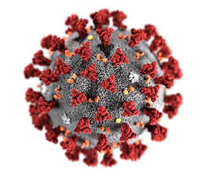

# COVID-19 Open Research Dataset Challenge (CORD-19) Analysis

    

## ***Project Overview***
In this project we carry out various Information Retrieval and Machine Learning methods to retrieve articles that are most relevant to the crucial medical questions given to us as tasks.
The Major tasks assigned to us are as follows:
- What is known about transmission, incubation, and environmental stability?
- What do we know about COVID-19 risk factors?
- What do we know about virus genetics, origin, and evolution?
- What do we know about vaccines and therapeutics?
- What has been published about medical care?
- What do we know about non-pharmaceutical interventions?
- What do we know about diagnostics and surveillance?
- What has been published about ethical and social science considerations?
- What has been published about information sharing and inter-sectoral collaboration?

We have four different approaches to our project.
1. Word2Vec
2. Doc2Vec
3. LDA
4. TF-IDF

## ***Dataset Description***
COVID-19 Open Research Dataset (CORD-19) has over 47,000 biology and medicine scholarly articles in various language, about 4300 of them are related to COVID-19, SARS-CoV-2, and coronaviruses, in English.
Original dataset contains fields like 
- cord_uid	
- sha	source_x	
- title	
- doi	
- license	
- abstract	
- publish_time	
- authors	
- journal	
- full_text_file	
- url	
- text	

For our purpose, we only extract some fields in the 4300 related articles
Fields includes:
- paper_id
- title
- abstract
- body_text
- url

The original dataset can be downloaded at
[Link](https://www.kaggle.com/allen-institute-for-ai/CORD-19-research-challenge)

The dataset we extracted can be downloaded at
[Link](https://drive.google.com/file/d/11gE-qSoao3sjkhXGevGEEWasgecaN0rG/view?usp=sharing)


## ***Our Apporaches***
Approach 1: Using spaCy for tokenization, Lemmatization and Removing stopwords and using scikit-learn to build our models for different batches of data and using Ensemble Techniques to create an aggregate prediction result.

Approach 2: Using NLTK for tokenization, Lemmatization and Removing Stop words and using scikit-learn to build our models for different batches of data.

Approach 3: Using Keras for performing Topic Modeling using LDA.

Approach 4: TF-IDF.

### Doc2vec Model
The Doc2vec model is a unsupervised model which transfers docs into vectors, and docs have similar meaning will close to each other in the vector space.

We assume the description of tasks and the possible answers of that will close to each other in the vectpr space.
So, firstly, we train the model with the 4300 articles, and use the descriptions of tasks to test the model - the model will transfer descriptions into vector, then we find out the most similar articles in the vector space.

For instance:

**Task1:**  What is known about transmission, incubation, and environmental stability?

- [Environmental Engineers and Scientists Have Important Roles to Play in Stemming Outbreaks and Pandemics Caused by Enveloped Viruses](https://www.ncbi.nlm.nih.gov/pmc/articles/PMC7099656/)

- [Journal Pre-proof Transmission of COVID-19 in the terminal stage of incubation period](https://doi.org/10.1016/j.ijid.2020.03.027)

- BERT Output: The frequency lt    of secondary transmission relative to diseaseage can be backcalculated by extracting the serial interval distribution st from a known transmission network and by using the incubation period distribution f   which is assumed known. This concept is illustrated in Fig. 2A . If we have information on the length t i of the serial interval for n cases the likelihood function is given by

**Task2:** What do we know about COVID-19 risk factors?

- [Association between 2019-nCoV transmission and N95 respirator use](https://doi.org/10.1101/2020.02.18.20021881)
- BERT Output: Our study is the first comprehensive attempt to systematically assess the effect of a multitude of possible risk factors on severe ALRI in children aged less than five years. We identified in total 19 risk factors which had been reported to be associated with severe ALRI in the published literature. We observed a consistent significant association between 7 risk factors lowbirthweight undernutrition indoor air pollution incomplete immunization at one year HIV breastfeeding and crowding and severe ALRI definite risk factors. We also observed that 7 risk factors parental smoking lack of maternal education vitamin D deficiency male sex preterm births anemia and zinc deficiency had an inconsistent association with severe ALRI that was not significant likely risk factors. We further observed that 5 risk factors daycare birth interval birth order previous history of ALRI and vitamin A deficiency were sporadically reported to be associated with severe ALRI possible risk factors.

**Task3:** What do we know about virus genetics, origin, and evolution?

- [Journal Pre-proof Bat influenza viruses: Making a double agent of MHC class II Bat influenza viruses](https://doi.org/10.1016/j.tim.2020.04.006)
- BERT Output: We know much about virus replication and disease. However our understanding of the specifi c mechanisms of persistence is generally poor. Persistence is a generally silent and inscrutable state it does not lend itself to in vitro or cell culture experimental models. We are left with but a few examples from which to attempt to extrapolate the possible existence of general relationships. The study of virus evolution thus struggles to incorporate concepts of persistence.

**Task4:** What do we know about vaccines and therapeutics? What has been published concerning research and development and evaluation efforts of vaccines and therapeutics?

- [Research and Development on Therapeutic Agents and Vaccines for COVID-19 and Related Human Coronavirus Diseases](https://www.ncbi.nlm.nih.gov/pmc/articles/PMC7094090/)
- BERT Output: The outbreak of HCoVEMC infection in Saudi Arabia has raised great concerns about the potential pandemic of the SARSlike disease and strategies for combating this newly emerged infectious disease should be prepared 2 . It is believed that the existing SARS research may provide a useful template for developing vaccines and therapeutics against HCoVEMC infection 3  but so far no effective antiSARS vaccines and therapeutics have been well developed.

**Task5:** What do we know about the effectiveness of non-pharmaceutical interventions? What is known about equity and barriers to compliance for non-pharmaceutical interventions?

- [CAN-NPI: A Curated Open Dataset of Canadian Non-Pharmaceutical Interventions in Response to the Global COVID-19 Pandemic](https://doi.org/10.1101/2020.04.17.20068460)
- BERT Output: In conclusion there remains a serious deficit in the evidence base of the efficacy of nonpharmaceutical interventions. The US Centers for Disease Control and Prevention have awarded grants to study non pharmaceutical interventions in community settings 40  including this study. Other funded study designs include symptombased recruitment as in our study and longitudinal studies of initially uninfected cohorts in children and adults and in various settings including households schools and student halls of residences. We eagerly anticipate that conclusive evidence will become available as these studies proceed in the coming months finally allowing empiricallydriven pandemic planning.

**Task6:** What do we know about diagnostics and surveillance? What has been published concerning systematic, holistic approach to diagnostics

- [Evaluation of antibody testing for SARS-CoV-2 using ELISA and lateral flow immunoassays](https://doi.org/10.1101/2020.04.15.20066407)
- BERT Output: RTPCR is a rapid and sensitive method that is being used increasingly as a supplement to serology for the diagnosis of arboviruses. The technique has wide application for clinical diagnostics as well as surveillance purposes. Conventional PCR methods for the amplification of bunyavirus genomes have previously been reported Kuno et al. 1996 Campbell and Huang 1999 Dunn et al. 1994 .

**Task7:** What has been published about medical care?

- [Cardiovascular Considerations for Patients, Health Care Workers, and Health Systems During the Coronavirus Disease 2019 (COVID-19) Pandemic](https://doi.org/10.1016/j.jacc.2020.03.031)
- BERT Output: The concerns of this aspect are on the sociocultural aspects of medical care and hospital as a social institution. There are often options in medical care especially traditional and modern approaches Alubo 2008 . This interaction of plural systems of health care may be complementary competitive or even conflicting. Choice is usually modified by the cultural belief system in the community. Another main issue is the cost of seeking medical care in relation to affordability and quality of services from medical institutions. These are interwoven issues that have constituted focal points in medical care. Another significant issue is the gender context of medical care and hospital. Analysis of gender issues in terms of care providers and receivers is vital in medical care. At times experts analyse the importance of cultural competence in health care delivery and desirability of gender concordance patientpractitioner in health care.

**Task8:** What has been published about ethical and social science considerations?

- [Supporting Clinicians During the COVID-19 Pandemic](https://www.ncbi.nlm.nih.gov/pmc/articles/PMC7106065/)
- BERT Output: In January 2006 the Council set up a working party to examine the ethical issues surrounding public health. This was chaired by Lord Krebs and included members with expertise in health economics law philosophy public health policy health promotion and social science. This article summarizes some of the conclusions and recommendations that were published in the report Public health ethical issues 1 in November 2007 and presented to the UK Public Health Association Annual Public Health Forum in April 2008.

**Task9:** What has been published about information sharing and inter-sectoral collaboration?

- [COVID-19: Vulnerability and the power of privilege in a pandemic](https://www.ncbi.nlm.nih.gov/pmc/articles/PMC7165578/)
- BERT Output: The aim is to support cooperation and coordinated action of EUMS to improve their capacities at points of entry airports ports groundcrossings in preventing and combating crossborder health threats from the transport sector. The action activities include the following a facilitating EU MS evaluating and monitoring of core capacities at PoE b strengthening inter sectoral and cross sectoral collaboration through a communication network c producing catalogues of tested best practices guidelines and validated action plans d providing capacity buildingtraining on tested best practices guidelines validated action plans e facilitating EU MSs coordinating and executing hygiene inspections on conveyances f combatting all types of health threats focusing on infectious disease and vectors g supporting response to possible future public health emergencies of international concern. In future public health emergencies the action will move from interepidemic mode to emergency mode supporting coherent response as per Decision n10822013EU International Health Regulations and WHO temporary recommendations.

**pro:** doc2vec provides useful articles to answer crucial questions

**cons:** it's a unsupervised model


### Markdown

Markdown is a lightweight and easy-to-use syntax for styling your writing. It includes conventions for

```markdown
Syntax highlighted code block

# Header 1
## Header 2
### Header 3

- Bulleted
- List

1. Numbered
2. List

**Bold** and _Italic_ and `Code` text

[Link](url) and 
```

For more details see [GitHub Flavored Markdown](https://guides.github.com/features/mastering-markdown/).

### Jekyll Themes

Your Pages site will use the layout and styles from the Jekyll theme you have selected in your [repository settings](https://github.com/josvin92/josvin92.github.io./settings). The name of this theme is saved in the Jekyll `_config.yml` configuration file.

### Support or Contact

Having trouble with Pages? Check out our [documentation](https://help.github.com/categories/github-pages-basics/) or [contact support](https://github.com/contact) and we’ll help you sort it out.
