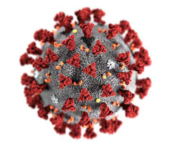

## Welcome to CS525 - Final Project Website

  

## ***Project Overview***
In this project we carry out various Information Retrieval and Machine Learning methods to retrieve articles that are most relevant to the crucial medical questions given to us as tasks.
The Major tasks assigned to us are as follows:
- What is known about transmission, incubation, and environmental stability?
- What do we know about COVID-19 risk factors?
- What do we know about virus genetics, origin, and evolution?
- What do we know about vaccines and therapeutics?
- What has been published about medical care?
- What do we know about non-pharmaceutical interventions?
- Geographic variations: how the disease will spread and if there are different variations of the virus in different areas?
- What do we know about diagnostics and surveillance?
- What has been published about ethical and social science considerations?
- What has been published about information sharing and inter-sectoral collaboration?

We have four different approaches to our project.
1. BERT
2. Doc2Vec
3. LDA
4. TF-IDF

## ***Dataset Description***
COVID-19 Open Research Dataset (CORD-19) has over 47,000 biology and medicine scholarly articles in various language, about 4300 of them are related to COVID-19, SARS-CoV-2, and coronaviruses, in English.
Original dataset contains fields like 
- cord_uid, sha	source_x, title	,doi ,license, abstract, publish_time, authors, journal, full_text_file, url, text.

For our purpose, we only extract some fields in the 4300 related articles
Fields includes:
- paper_id, title, abstract, body_text, url.

The original dataset can be downloaded at
[Link](https://www.kaggle.com/allen-institute-for-ai/CORD-19-research-challenge)

The dataset we extracted can be downloaded at
[Link](https://drive.google.com/file/d/11gE-qSoao3sjkhXGevGEEWasgecaN0rG/view?usp=sharing)

## ***Our Approaches***
Approach 1: TF-IDF
Using spaCy for tokenization, Lemmatization and Removing stopwords and using scikit-learn to build our models for different batches of data and using Ensemble Techniques to create an aggregate prediction result.

Approach 2: LDA Using Keras for performing Topic Modeling
Using NLTK for tokenization, Lemmatization and Removing Stop words and using scikit-learn to build our models for different batches of data.

Approach 3: Doc2Vec

Approach 4: BERT using cdqa.

### TF-IDF:Term frequency–inverse document frequency.

**TF (Term Frequency) :** The frequency with which a word appears in the current text, a high-frequency word or an important word (such as "natural language processing") or a common word (such as "I", "Yes", "", etc.) ;

**IDF (Inverse Document frequency) :** Document frequency refers to the proportion of Documents containing a word in the entire corpus. The inverse Document frequency is the reciprocal of the Document frequency;

**Advantages:**
- Easy to compute
- You have some basic metric to extract the most descriptive terms in a document
- You can easily compute the similarity between 2 documents using it

**Disadvantages:**
- TF-IDF is based on the bag-of-words (BoW) model, therefore it does not capture position in text, semantics, co-occurrences in different documents, etc.
- For this reason, TF-IDF is only useful as a lexical level feature
- Cannot capture semantics (e.g. as compared to topic models, word embeddings)

### LDA Model

LDA is a form of unsupervised learning which views documents as bags of words (ie order does not matter). 
Latent refers to everything that we don’t know a priori and are hidden in the data. 
Dirichlet is the distribution of topics in documents and distribution of words in the topic.
Allocation means that once we have Dirichlet, we will allocate topics to the documents and words of the document to topics.

All topic models are based on the same basic assumption:
- each document consists of a mixture of topics, and
- each topic consists of a collection of words.

**Advantages:**
- LDA is a probabilistic model with interpretable topics. 

**Disadvantages:**
- The disadvantages are that it is hard to know when LDA is working --- topics are soft-clusters so there is no objective metric to say "this is the best choice" of hyperparameters.

### Doc2vec Model
The Doc2vec model is a unsupervised model which transfers docs into vectors, and docs have similar meaning will close to each other in the vector space.

We assume the description of tasks and the possible answers of that will close to each other in the vectpr space.
So, firstly, we train the model with the 4300 articles, and use the descriptions of tasks to test the model - the model will transfer descriptions into vector, then we find out the most similar articles in the vector space.

### BERT Model
BERT (Bidirectional Encoder Representations from Transformers) is a recent paper published by researchers at Google AI Language. BERT’s key technical innovation is applying the bidirectional training of Transformer, a popular attention model, to language modelling. This is in contrast to previous efforts which looked at a text sequence either from left to right or combined left-to-right and right-to-left training.

cdQA is to allow anyone to ask a question in natural language and get an answer without having to read the internal documents relevant to the question.Its' goal is to make the internal search experience faster and more natural thanks to the latest advances in natural language processing using deep learning techniques.

I used a prebuilt BERT model from cdqa for my query answering. 

### Results

**Task1:**  What is known about transmission, incubation, and environmental stability?

- Doc2vec output:[Environmental Engineers and Scientists Have Important Roles to Play in Stemming Outbreaks and Pandemics Caused by Enveloped Viruses](https://www.ncbi.nlm.nih.gov/pmc/articles/PMC7099656/)

- [Journal Pre-proof Transmission of COVID-19 in the terminal stage of incubation period](https://doi.org/10.1016/j.ijid.2020.03.027)

- BERT Output: The frequency lt    of secondary transmission relative to diseaseage can be backcalculated by extracting the serial interval distribution st from a known transmission network and by using the incubation period distribution f   which is assumed known. This concept is illustrated in Fig. 2A . If we have information on the length t i of the serial interval for n cases the likelihood function is given by
- LDA Output: 
- RESULT #1: The world is currently faced with a pandemic of novel coronavirus disease 2019 (COVID- 19) , which is caused by Severe Acute Respiratory Syndrome coronavirus 2 (SARS-CoV-2) and has no vaccine or cure. It is predicted the development of a safe and effective vaccine to prevent COVID-19 will take one year to 18 months, by which time it is likely that several hundreds of thousands to millions of people may have been infected.
- RESULT #2: "the loss of sense of smell as a marker of COVID-19 infection." They proposed that adults presenting with anosmia but no many other symptoms should self-isolated for seven days [4] . This has been followed by a larger series of 2,428 patients presenting with new onset anosmia during the COVID-19 pandemic of whom 16% reported loss of sense of smell as isolated symptom.
- RESULT #3: From the first detected outbreak of a new member of the coronavirus (CoV) family 1 in Wuhan, Hubei Province, China 2,3 , SARS-CoV-2 4 has rapidly spread around the world 5 , with governments and institutions showing mixed results in its effective containment 6 .

- TF-IDF Output: A Generalized Discrete Dynamic Model for Human.

**Task2:** What do we know about COVID-19 risk factors?

- Doc2vec output: [Association between 2019-nCoV transmission and N95 respirator use](https://doi.org/10.1101/2020.02.18.20021881)
- BERT Output: Our study is the first comprehensive attempt to systematically assess the effect of a multitude of possible risk factors on severe ALRI in children aged less than five years. We identified in total 19 risk factors which had been reported to be associated with severe ALRI in the published literature. We observed a consistent significant association between 7 risk factors lowbirthweight undernutrition indoor air pollution incomplete immunization at one year HIV breastfeeding and crowding and severe ALRI definite risk factors. We also observed that 7 risk factors parental smoking lack of maternal education vitamin D deficiency male sex preterm births anemia and zinc deficiency had an inconsistent association with severe ALRI that was not significant likely risk factors. We further observed that 5 risk factors daycare birth interval birth order previous history of ALRI and vitamin A deficiency were sporadically reported to be associated with severe ALRI possible risk factors.
- LDA Output: 
- RESULT #1: Severe acute respiratory syndrome known as COVID-19 disease (due to SARS-CoV-2 virus), is recognized to spread via respiratory droplets and close contacts [1] .
- RESULT #2: 'COVID-19 is a highly infectious novel coronavirus whose spread has rapidly led to a global pandemic since the first cases were identified in China in late 2019 (Huang et al. 2020 ).

- TF-IDF Output: SARS-CoV-2 in wastewater: potential health risk.

**Task3:** What do we know about virus genetics, origin, and evolution?

- Doc2vec output: [Journal Pre-proof Bat influenza viruses: Making a double agent of MHC class II Bat influenza viruses](https://doi.org/10.1016/j.tim.2020.04.006)
- BERT Output: We know much about virus replication and disease. However our understanding of the specifi c mechanisms of persistence is generally poor. Persistence is a generally silent and inscrutable state it does not lend itself to in vitro or cell culture experimental models. We are left with but a few examples from which to attempt to extrapolate the possible existence of general relationships. The study of virus evolution thus struggles to incorporate concepts of persistence.
- LDA Output: 
- RESULT #1: Abstract. 17 years after the SARS-CoV epidemic, the world is facing the COVID-19 pandemic. COVID-19 is caused by a coronavirus named SARS-CoV-2. 
- RESULT #2: The transcriptome of the virus is a fundamental aspect of its biology. For We developed an informatics pipeline to infer sgRNA profiles from these short reads samples. 

- TF-IDF Output: An interactive web-based dashboard to track COVID19.

**Task4:** What do we know about vaccines and therapeutics? What has been published concerning research and development and evaluation efforts of vaccines and therapeutics?

- Doc2vec output: [Research and Development on Therapeutic Agents and Vaccines for COVID-19 and Related Human Coronavirus Diseases](https://www.ncbi.nlm.nih.gov/pmc/articles/PMC7094090/)
- BERT Output: The outbreak of HCoVEMC infection in Saudi Arabia has raised great concerns about the potential pandemic of the SARSlike disease and strategies for combating this newly emerged infectious disease should be prepared 2 . It is believed that the existing SARS research may provide a useful template for developing vaccines and therapeutics against HCoVEMC infection 3  but so far no effective antiSARS vaccines and therapeutics have been well developed.
- LDA Output: 
- RESULT #1: low-frequency glycosylation may occur, because our integrated methods, including glycopeptide enrichment and deglycosylation, failed to improve the spectra. Apart from the canonical N-glycosylation sequons, three non-canonical motifs of N-glycosites (N164, N334, and N536) involving N-X-C sequons were not glycosylated. Before enrichment, an average of 15 N-glycosites from trypsin-digested peptides and 13 N-glycosites from Glu-C-digested peptides were assigned.
- RESULT #2: have issues in the lack of inducing complete protection and possible safety concerns 7,8 . All 77 existing SARS/MERS vaccines were reported to induce neutralizing antibodies and partial 78 protection against the viral challenges in animal models (Table 2) , but it is desired to induce 79 complete protection or sterile immunity.

- TF-IDF Output: Chloroquine and hydroxychloroquine in the treatment of covid19.

**Task5:** What do we know about the effectiveness of non-pharmaceutical interventions? What is known about equity and barriers to compliance for non-pharmaceutical interventions?

- Doc2vec output: [CAN-NPI: A Curated Open Dataset of Canadian Non-Pharmaceutical Interventions in Response to the Global COVID-19 Pandemic](https://doi.org/10.1101/2020.04.17.20068460)
- BERT Output: In conclusion there remains a serious deficit in the evidence base of the efficacy of nonpharmaceutical interventions. The US Centers for Disease Control and Prevention have awarded grants to study non pharmaceutical interventions in community settings 40  including this study. Other funded study designs include symptombased recruitment as in our study and longitudinal studies of initially uninfected cohorts in children and adults and in various settings including households schools and student halls of residences. We eagerly anticipate that conclusive evidence will become available as these studies proceed in the coming months finally allowing empiricallydriven pandemic planning.
- LDA Output: 
- RESULT #1: The COVID-19 pandemic is a devastating historical event which is currently impacting nearly all of mankind. SARS CoV-2 incidence is surging in numerous cities and countries across the globe (1), and infection carries a high mortality rate, particularly among the elderly (2) (3) (4) .
- RESULT #2: The first cases of infection with a novel coronavirus, subsequently designated SARS-CoV-2, emerged in Wuhan, China on December 31 st , 2019. 

- TF-IDF Output: Responding to the Pandemic of Falsified Medicines

**Task6:** What do we know about diagnostics and surveillance? What has been published concerning systematic, holistic approach to diagnostics

- Doc2vec output: [Evaluation of antibody testing for SARS-CoV-2 using ELISA and lateral flow immunoassays](https://doi.org/10.1101/2020.04.15.20066407)
- BERT Output: RTPCR is a rapid and sensitive method that is being used increasingly as a supplement to serology for the diagnosis of arboviruses. The technique has wide application for clinical diagnostics as well as surveillance purposes. Conventional PCR methods for the amplification of bunyavirus genomes have previously been reported Kuno et al. 1996 Campbell and Huang 1999 Dunn et al. 1994 .
- LDA Output: 
- RESULT #1: Background COVID-19 caused by the SARS-CoV-2 virus is a worldwide pandemic with significant morbidity and mortality estimates from 1-4% of confirmed cases 1 .
- RESULT #2: In this paper, we provide estimates of the historical probabilities of success (PoS) of clinical trials for vaccines and other therapeutic drugs for infectious diseases to inform discussions on the planning and financing of the fight against one of humanity's oldest foes.

- TF-IDF Output: Feasibility of Using Convalescent Plasma Immunity.

**Task7:** What has been published about medical care?

- Doc2vec output: [Cardiovascular Considerations for Patients, Health Care Workers, and Health Systems During the Coronavirus Disease 2019 (COVID-19) Pandemic](https://doi.org/10.1016/j.jacc.2020.03.031)
- BERT Output: The concerns of this aspect are on the sociocultural aspects of medical care and hospital as a social institution. There are often options in medical care especially traditional and modern approaches Alubo 2008 . This interaction of plural systems of health care may be complementary competitive or even conflicting. Choice is usually modified by the cultural belief system in the community. Another main issue is the cost of seeking medical care in relation to affordability and quality of services from medical institutions. These are interwoven issues that have constituted focal points in medical care. Another significant issue is the gender context of medical care and hospital. Analysis of gender issues in terms of care providers and receivers is vital in medical care. At times experts analyse the importance of cultural competence in health care delivery and desirability of gender concordance patientpractitioner in health care.
- LDA Output: 
- RESULT #1: In December 2019, a pneumonia caused by a previously unknown coronavirus emerged in Wuhan, Hubei Province, China. During the subsequent weeks and months, the disease, later named COVID-19, spread rapidly nationwide and globally, and was declared a global pandemic by the World Health Organization.
- RESULT #2: Currently, the world is facing an unprecedented health crisis caused by the novel coronavirus disease . To track and hopefully curb this pandemic, large-scale laboratory testing for COVID-19 is becoming widespread.

- TF-IDF Output: Asymptomatic and Presymptomatic SARS-CoV-2 Infected Patients.

**Task8:** What has been published about ethical and social science considerations?

- Doc2vec output: [Supporting Clinicians During the COVID-19 Pandemic](https://www.ncbi.nlm.nih.gov/pmc/articles/PMC7106065/)
- BERT Output: In January 2006 the Council set up a working party to examine the ethical issues surrounding public health. This was chaired by Lord Krebs and included members with expertise in health economics law philosophy public health policy health promotion and social science. This article summarizes some of the conclusions and recommendations that were published in the report Public health ethical issues 1 in November 2007 and presented to the UK Public Health Association Annual Public Health Forum in April 2008.
- LDA Output: 
- RESULT #1: Since December 2019, the outbreak of COVID-19 in Wuhan has infected more than 70,000 individuals. China has taken active and effective actions to provide medical support for aiding in the control of the rapid spread of COVID-19. From January 24, 2020 (Chinese New Year's Eve), China has sent more than 30,000 medical staff to Wuhan city and Hubei province to provide medical support. 
- RESULT #2: The current outbreak of the novel coronavirus disease (COVID-19) has led to sweeping changes in healthcare practice and clinical recommendations (1) .

- TF-IDF Output: Ebola Virus Disease Ethics and Emergency Medical Practices.

**Task9:** What has been published about information sharing and inter-sectoral collaboration?

- Doc2vec output: [COVID-19: Vulnerability and the power of privilege in a pandemic](https://www.ncbi.nlm.nih.gov/pmc/articles/PMC7165578/)
- BERT Output: The aim is to support cooperation and coordinated action of EUMS to improve their capacities at points of entry airports ports groundcrossings in preventing and combating crossborder health threats from the transport sector. The action activities include the following a facilitating EU MS evaluating and monitoring of core capacities at PoE b strengthening inter sectoral and cross sectoral collaboration through a communication network c producing catalogues of tested best practices guidelines and validated action plans d providing capacity buildingtraining on tested best practices guidelines validated action plans e facilitating EU MSs coordinating and executing hygiene inspections on conveyances f combatting all types of health threats focusing on infectious disease and vectors g supporting response to possible future public health emergencies of international concern. In future public health emergencies the action will move from interepidemic mode to emergency mode supporting coherent response as per Decision n10822013EU International Health Regulations and WHO temporary recommendations.
- LDA Output: 
- RESULT #1: https://www.biorxiv.org/content/10.1101/2020.03.25.008805v2.full - An artificial intelligence-based first-line defence against COVID-19: digitally screening citizens for risks via a chatbot
- RESULT #2: https://doi.org/10.1101/2020.04.19.20069948 - A Chronological and Geographical Analysis of Personal Reports of COVID-19 on Twitter

- TF-IDF Output: TAXONOMY, CLASSIFICATION AND NOMENCLATURE OF VIRUSES.

### Conclusion
- We found that the best ones were LDA and Doc2Vec as they returned the related articles, unlike BERT which returns a convolution of the articles.
- The results of the first round were released on April 15th. Most of the winners used LDA, recommender systems and other variations of these. 
- The documents that we got from LDA and Doc2Vec are a subset or a superset of the winning results depending on the parameters we give.
- Also, since it’s unsupervised learning, and no test/validation set is provided we wouldn’t be able to tell anything about the accuracy/precision of the model.

[Link to the repository containing our project files](https://github.com/alicekenway/CS525_finalpj)

